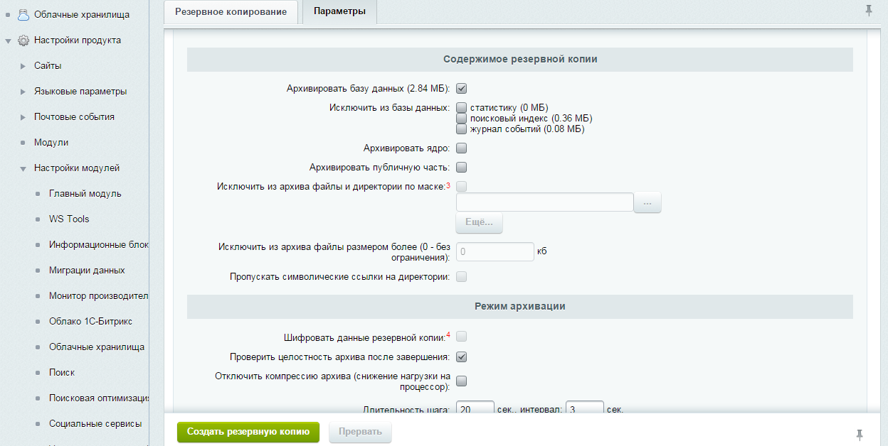
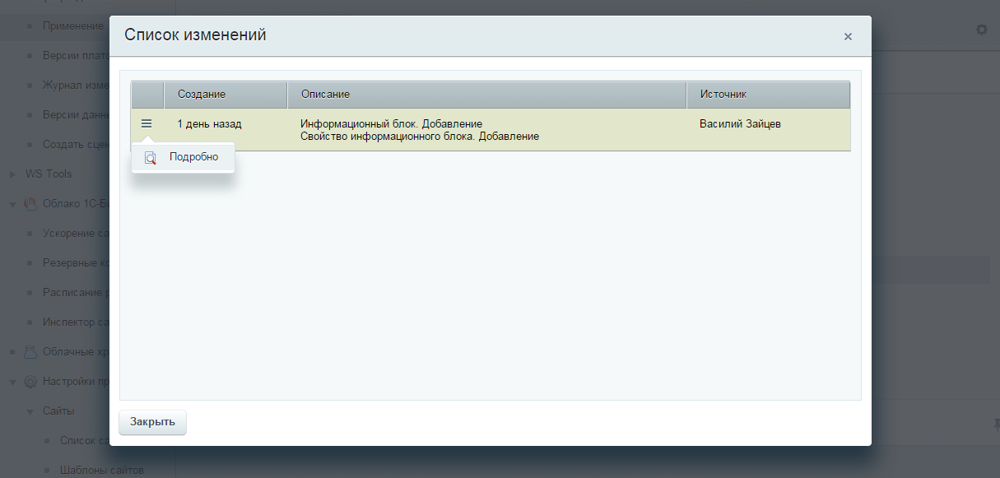
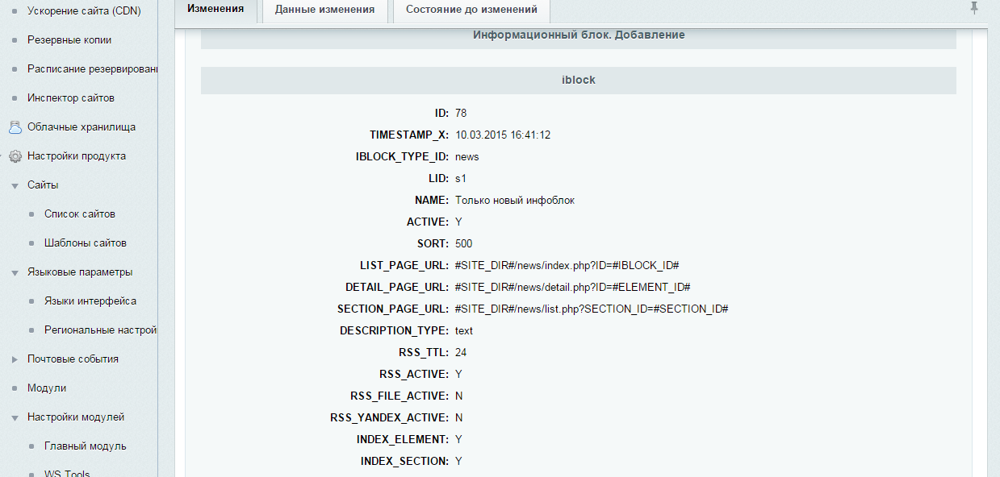
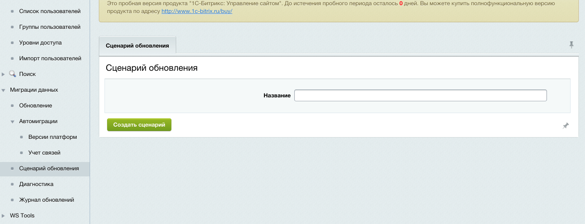
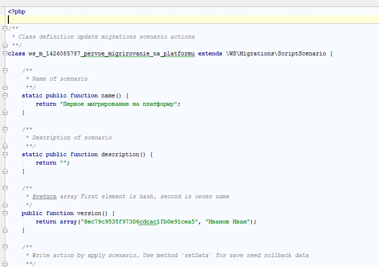

Модуль миграций
===============

Как известно исходный код плотно взаимодействует со структурой данных в проекте. С появлением новых функциональных требований исходный код изменяется,
он требует новые поля для хранения даных либо обределяет новые сущности которые отражаются в отдельных таблицах,
а в проектах основанных CMS Bitrix данные в основном отражены в инфоблоках. Основная структура хранения данных проекта написанного на Битриксе отличается от общепринятой.
Сущности хранятся не в отдельных таблицах, а абстрагированны в виде инфоблоков в разных местах, поэтому стандартные
инструменты работы с данными, в таких проектах, не всегда справляются со своими задачами. Модуль миграций основан на исходном коде ядра CMS и поэтому 
позволяет в наиболее удобной форме осуществлять синхронизацию. Идея состоит в том,
что проект имеет специальный катлог для хранения файлов описывающих приобразование данных, этот каталог обновляется вместе с исходым кодом проекта.
При обновлении исходного кода можно обвновить базу данных проекта чтобы она соответствовала новому функционалу.

Модуль имеет два типа синхронизации:

1. Автоматическая - сихронизируются базовые данные инфоблоков, свойств, секций
2. Сценарии миграции - этап обновления реализуется разработчиком согласно требуемого алгоритма

### Установка и настройка

###### [Bitrix Marketplace](http://marketplace.1c-bitrix.ru/solutions/ws.migrations/)

Для установки в адресную строку сайта, после доменного имени, прописать:

```
/bitrix/admin/update_system_partner.php?addmodule=ws.migrations
```

При установке модуля необходимо определить основные параметры.

Установка и обновление модуля через ```marketplace``` обязательна, т.к. происходят процедуры подготовки базы данных и файлов 

###### Определение параметров при установке модуля

Для успешной работы модуля необходимо определить каталог, где будут создаваться файлы синхронизации данных.
Каталог сделать должен учитываться системой версионирования проекта.
Так же можно определить настройку автоматически синхронизирующихся данных.


###### Настройка модуля

После установки модуля в настройках можно активировать/дективировать учет изменений данных касающихся функционала инфоблоков.
На текущий момент это: Информационный блок, Свойство информационного блока, Раздел информационного блока.
Если оставить эти обработчики неактивными автоматический учет изменения данных производится не будет.
Необходимо учитывать что если деативировать обработчики автоматических изменений, то их активация спустя некоторое время приведет
к неутишительным результатам обновления.


##### Версия платформы

Основной необходимостью применения уникальной версии для каждой платформы является испольование в CMS числовых данных для идентификации
сущностей и полей инфоблоков. Есть еще символьные коды, но они не являются обязательными поэтому модулю на них полагаться не стоит.
Таким образом каждая платформа (копия) проекта должна обладать собственной версией (HASH). Версия вычисляется при установке модуля, либо по требованию
в административном интерфейсе.
Версия патформы хранится в файле `uploads/ws.migrations/version.dat`. При импорте данных с другой площадки не нужно менять этот файл.


### Начало работы

Для старта успешного применения модуля миграций в проекте необходимо произвести инициализацию начального состояния,
состоит из следующих этапов:

1. Установить модуль на всех площадках.

2. Определить какая версия (копия или площадка) проекта является наиболее актуальной.
К примеру для проекта, который находится в разработке наиболее актуальной версией является одна из версий разработчиков, либо демонстрационная.
В проекте, которому обеспечивается техническая поддержка - наоборот, наиболее актуальной можно назвать `production` версию.

3. При помощи функцинала резервного копирования подготовить копию данных актуальной версии

[Подробнее про резервное копирование](http://dev.1c-bitrix.ru/learning/course/index.php?COURSE_ID=35&LESSON_ID=2031)

4. Обновить данные на другой площадке из созданной резервной копии при помощи скрипта [`restore.php`](http://www.1c-bitrix.ru/download/scripts/restore.php)

5. Выполнить очистку файлов кэширования на той площадке где была применена резервная копия.

Теперь ваша площадка с `модулем миграций` полностью готова к работе.
Первоначальное выполнение вышеперечисленных действий в дальнейшем обеспечивает комфорт при разработки проектов.  

### Автоматический учет изменений (фиксация в файлы)

Учет изменений осуществляется при помощи обработки событий изменения предметной области,
события регистрируются для каждого обработчика модуля (например есть обработчик миграций разделов информационных блоков).
При этом обработчик, как правило, обрабатывает только один тип сущности. Обработчик, должен иметь три основных интерфейсных метода:

1. `getSnapshot` получение снимка данных для записи

2. `applySnapshot` примененеи в БД снимка данных для записи

3. `delete` удаление записи из БД 

При событии изменении данных вызываются определенные методы обработчика для создания нового снимка схемы данных,
который помещается во вновь созданную фиксацию и сохраняется в файл (формат json).

### Обновление площадки

Обновление осуществляется путем анализа файлов фиксаций,
вычисляются новые файловые фиксации (которые небыли исполнены для текущей копии проекта),
данные фиксаций передаются обработчикам для обновления. Т.о. получается что обработчик который делал снимок, он же этот снимок и востанавливает на текущей БД.

```
При работе с несколькими версиями и созданием новых записей возникает проблема "одновременного"
создания новой записи и рассинхронизация модели данных. Поэтому при создании новых записей данных 
сторонних версий создаются фиксации учета ссылок текущей версии,
которые так же необходимо экспортировать синхронизировть файлы каталога миграций. 
```

###### Основной интерфейс обнвления.


###### Интерфейс применения миграций. Просмотр перечня изменений.



###### Подробная информация для анализа изменения



### Отмена уже примененных миграций

Любые изменения фиксаций журналируются. Сохраняются как новые данные, так и снимок созданный перед применением миграций.
Таким образом существует возможность отката последнего обновления. Так же стоит отметить,
что обновления устанавливаются пакетами и при применении обновлений сохраняется запись о пользователе установившем обновления и времени обновления.

### Работа со скриптами миграций

Если стандартного функционала не хватает для поддержки версий (копий) проекта в актуальном состоянии, `модуль миграций` предоставляет
функционал создания "гибкой миграции" путем определения сценария миграции программистом. Так же имеется набор классов для быстрого и удобного
создания новых данных.

#### 1. Создание класса сценария миграции

Создание класса сценария осуществляется из меню `Миграции данных -> Сценарий обновления`,
где необходимо ввести название сценария и описание

###### Создание сценария. Ввод названия



Название можно задавать кириллицей. После появляется сообщение с информацией о местонахождении файла класса

#### 2. Редактирование. Определение алгоритма исполнения скрипта

По пути описанному в сообщении находится следующий класс

###### Сценарий. Редактирование класса



В нем предназначены для модификации два метода:
* `commit` - содержит алгоритм применения миграции
* `rollback` - содержит алгоритм отката миграции

Методы `getData` и `setData` предоставляют доступ к данным и их сохранение соответственно, необходимо для сохранения данных для отката.

В случае, если скрипты миграций работают в тандеме с автоматическими миграциями классу сценария предоставлен доступ к контролеру ссылок `$this->getReferenceController()` для
регистрации или получения идентификаторов записей согласно версиям копий проекта, он необходим для работы с сущностями которые также затрагиваются автомиграциями.

#### 3. Применение

Применение сценариев миграций осуществляется через функционал общего применения.

###### Применение сценариев миграций


Данные по сценариям миграций так же попадают в журнал изменений. В анализе изменений можно просмотреть промежуточную информацию.

###### Журнал изменений


### Работа в командной строке

В версии модуля `1.5.0` появилась возможность работать с подготовленными миграциями из командной строки. Есть несколько приемущиств 
именно этого подхода:

  1. Время выолпнения миграций не ограничено таймаутом сервера
  
  2. Возможность автоматизировать обновление миграций совместно с обновлением кода. К примеру можно интегрировать механихм обновления миграций 
  при помощи функционала перехватчиков `СУРВ Git`

##### Использование

  Файл для работы с миграцими через интерфейс командной строки расположен по пути `bitrix/tools/ws_migrations.php`

  * Вызов помощи, отображает список доступных действий
  
  
  
  * Просмотр списка подготовленных миграций, если есть проблемы с кодировкой можно воспользоваться утилитой преобразования
  
  
  
  * Применение подготовленных миграций
  
  
  
  * Откат последнего применения
  
  
